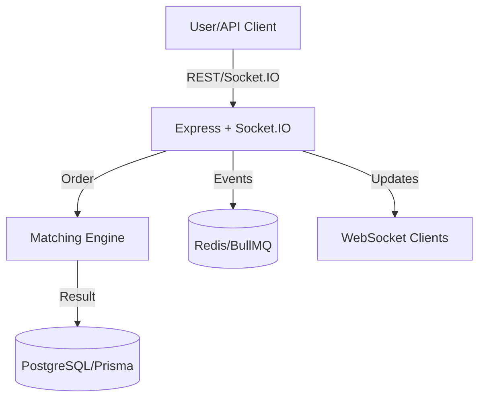

# 🚀 StockSIMAPI – Real-Time Trading Exchange Backend

Welcome to **StockSIMAPI** – a backend that doesn’t just process orders, but simulates the pulse of a real stock exchange. If you want to learn, build, or extend a trading platform with real-world mechanics, you’re in the right place.

---

## 🏆 What Makes This Special?

- **Full Trade Lifecycle:** From order intake to portfolio update, every step is simulated.
- **Real-Time Everything:** Orders, trades, and prices update instantly via WebSockets.
- **Concurrency-Safe:** No race conditions – balances and orders are always accurate.
- **Production-Ready:** Modular, scalable, and secure by design.

---

## 🏗️ Architecture at a Glance



- **Express**: Handles REST APIs
- **Socket.IO**: Real-time events
- **Prisma + PostgreSQL**: Data & transactions
- **BullMQ + Redis**: Job queues & caching

---

## ⚡ Quickstart

1. **Clone & Install**

   ```bash
   git clone https://github.com/Sherma-ThangamS/TradingSystemAPI
   cd TradingSystemAPI
   npm install
   ```

2. **Configure Environment**

   - Copy `.env.example` to `.env` and fill in your secrets.

3. **Setup Database**

   ```bash
   npx prisma migrate dev --name init
   npx prisma generate
   ```

4. **Run the Server**
   ```bash
   npm run dev
   ```

---

## 🧩 Core Features

### 1. Matching Engine

- **How:** In-memory, price-time priority, partial fills.
- **Why:** Simulates real exchange order matching.
- **What:** Handles buy/sell, cancels, and executes trades atomically.

### 2. Funds & Portfolio Management

- **How:** Reservation model (wallet, reserved_wallet, reserved_quantity).
- **Why:** Prevents overspending/selling, ensures fair settlement.
- **What:** Updates balances and holdings after every trade.

### 3. Real-Time Notifications

- **How:** Socket.IO events for trades, orders, portfolios.
- **Why:** Users see updates instantly, just like a real trading app.
- **What:** Custom channels for each user and stock.

### 4. Security & Validation

- **How:** JWT, refresh tokens, CSRF, Zod validation, rate limiting.
- **Why:** Keeps your app and users safe.
- **What:** All endpoints are protected and validated.

---

## 📡 WebSocket Event Reference

| Event               | Channel      | Payload                     |
| ------------------- | ------------ | --------------------------- |
| `TRADE_EXECUTED`    | `stock:{id}` | Trade details               |
| `ORDER_FILLED`      | `user:{id}`  | Order status, remaining qty |
| `ORDER_CANCELLED`   | `user:{id}`  | Cancelled order ID          |
| `PORTFOLIO_UPDATED` | `user:{id}`  | Wallet, holdings update     |

---

## 🔗 Key API Endpoints

| Method | Route                       | Description          |
| ------ | --------------------------- | -------------------- |
| POST   | `/api/orders`               | Place buy/sell order |
| DELETE | `/api/orders/:id`           | Cancel open order    |
| GET    | `/api/orders`               | List user’s orders   |
| GET    | `/api/orders/:id`           | Get order details    |
| GET    | `/api/stocks/:id/orderbook` | Get stock order book |

---

## 🛠️ Tech Stack

- **Node.js** (Express)
- **Prisma** (PostgreSQL)
- **Redis** (BullMQ, caching)
- **Socket.IO** (WebSockets)
- **Zod** (Validation)

---

## 🧠 FAQ

**Q: Can I use this for real trading?**  
A: No, this is for simulation/education only.

**Q: How do I add new stocks or users?**  
A: Use the Prisma client or extend the API.

**Q: Can I run this in production?**  
A: Yes, but review security and scaling for your needs.

---

## 🗺️ Roadmap

- [ ] Limit orders with expiration
- [ ] Admin dashboard
- [ ] Historical trade charts
- [ ] Real P&L analytics
- [ ] Swagger/OpenAPI docs

---

## 👨‍💻 Maintainer

**Kishore Kumar K**  
Backend Developer | System Designer | Code Performance Enthusiast

---

**Ready to simulate the markets?**  
Clone, run, and start trading!
